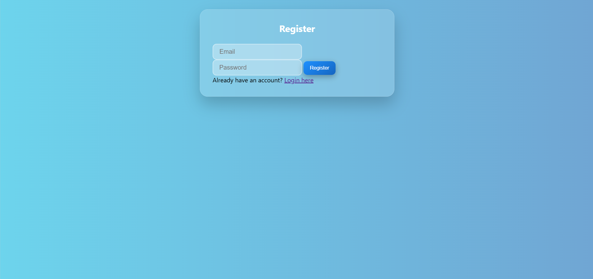
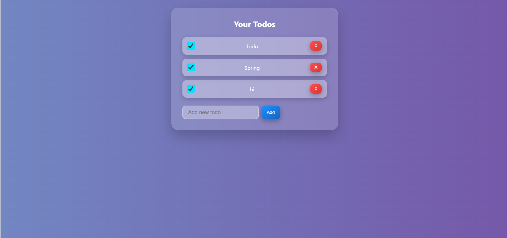

# 📝 Todo App (Full Stack)

A full-stack Todo application built using **Spring Boot + JavaScript + JWT Authentication**.

---

## 🚀 Features

* User Registration & Login (JWT Authentication)
* Add, Update, Delete Todos
* Mark Todos as Completed
* Secure APIs with Spring Security
* RESTful API design

---

## 🛠 Tech Stack

* Backend: Spring Boot, Spring Security, JPA
* Database: H2 / PostgreSQL
* Frontend: HTML, CSS, JavaScript
* Authentication: JWT

---

## 🔐 API Endpoints

| Method | Endpoint          | Description   |
| ------ | ----------------- | ------------- |
| POST   | /auth/register    | Register user |
| POST   | /auth/login       | Login user    |
| GET    | /api/v1/todo      | Get all todos |
| POST   | /api/v1/todo      | Create todo   |
| PUT    | /api/v1/todo      | Update todo   |
| DELETE | /api/v1/todo/{id} | Delete todo   |

---

## ▶️ Run Locally

### Backend

```bash
mvn spring-boot:run
```

### Frontend

Open `index.html` using Live Server

---

## 📸 Screenshots

## 🏠 Login Page


## 📝 Register Page


## ✅ Todo Dashboard


---
## Live Demo

Frontend: https://smarttodo-manager.netlify.app/

Backend: https://springboot-todo-jwt.onrender.com

---

## Future upgrades

To make it internship-level stronger:

* Swagger/OpenAPI
* Refresh token auth
* User profile page
* Responsive mobile UI
* React frontend
* Docker Compose
* CI/CD GitHub Actions

---

## 📌 Future Improvements

* Add edit UI
* Improve design using Bootstrap
* Deploy to cloud

---
